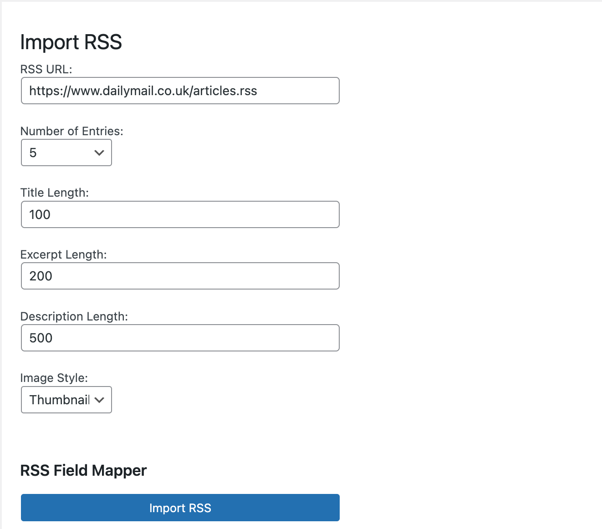
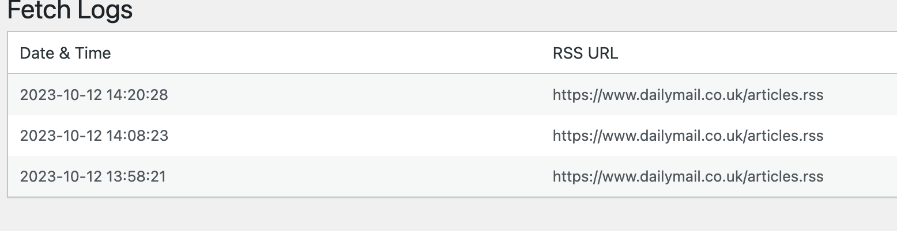

# DualDynamics Plugin

A  WordPress plugin to seamlessly integrate RSS feeds into WordPress posts. This plugin also introduces a custom widget for displaying the latest 5 posts.

# Screenshoots 

## Table of Contents

- [Description](#description)
- [Installation](#installation)
- [Usage](#usage)
- [Changelog](#changelog)
- [License](#license)
- [Credits](#credits)

## Description

This plugin provides a RESTful API CRUD mechanism to convert an RSS feed into WordPress posts. It's specially designed for DMG media to offer a seamless integration of external feeds into their WordPress instance.

### Key Features:

- RESTful API CRUD operations.
- Automatic conversion of RSS feed into WordPress posts.
- A custom widget to showcase the latest 5 posts.
- Extensible design allowing for the easy addition of more RSS feed sources.
- Implemented using Test-Driven Development (TDD) to ensure reliability.
- Logging capability to track RSS feed fetch operations.

## Installation

1. Upload the `dualdynamics` directory to the `/wp-content/plugins/` directory.
2. Activate the plugin through the 'Plugins' menu in WordPress.
3. Access the admin section to manage the settings.

## Usage

### Importing RSS Feeds:

1. Navigate to the `DualDynamics` section in your WordPress admin.
2. Choose the source of your RSS feed.
3. Click on the `Import` button.

### Using the Widget:

1. Navigate to `Appearance` > `Widgets`.
2. Drag the `Latest 5 Posts` widget to your desired sidebar or widget area.
3. Save the widget settings.

## Changelog

### 1.0.0

- Initial release of the plugin.
- Introduced RSS feed to WordPress post-conversion.
- Introduced a custom widget for displaying the latest 5 posts.

## License

This plugin is licensed under the GPL-2.0+ License. For more details, visit [GPL-2.0+](http://www.gnu.org/licenses/gpl-2.0.txt).

## Credits

**Developer:** Mokter Hossian  
**GitHub:** [moktermd08](https://github.com/moktermd08)  
**Plugin URI:** [DualDynamics on GitHub](https://github.com/moktermd08/dualdynamics)  
**Plugin boiler plate** [Wordpress Plugin Boilerplate](https://github.com/DevinVinson/WordPress-Plugin-Boilerplate/tree/master)
